# [Learning Deep CNN Denoiser Prior for Image Restoration](http://www4.comp.polyu.edu.hk/~cslzhang/paper/IRCNN_CVPR17.pdf)


# Abstract
Model-based optimization methods and discriminative learning methods have been the two dominant strategies for solving various inverse problems in low-level vision.
Typically, those two kinds of methods have their respective merits and drawbacks, e.g., model-based optimization methods are flexible for handling different inverse problems but are usually time-consuming with sophisticated priors for the purpose of good performance; in the meanwhile, discriminative learning methods have fast testing speed but their application range is greatly restricted by the specialized task.
Recent works have revealed that, with the aid of variable splitting techniques, denoiser prior can be plugged in as a modular part of model-based optimization methods to solve other inverse problems (e.g., deblurring). Such an integration induces considerable advantage when the denoiser is obtained via discriminative learning. However, the study of integration with fast discriminative denoiser prior is still lacking. To this end, this paper aims to train a set of fast and effective CNN (convolutional neural network) denoisers and integrate them into model-based optimization method to solve other inverse problems. Experimental results demonstrate that the learned set of denoisers can not only achieve promising Gaussian denoising results but also can be used as prior to deliver good performance for various low-level vision applications.

# Basic Idea
With the aid of variable splitting techniques, such as alternating direction method of multipliers (ADMM) method and half quadratic splitting (HQS) method, it is possible to deal
with fidelity term and regularization term of general image restoration formulation separately, and particularly, the regularization term only corresponds to a denoising subproblem. 
Consequently, this enables an integration of any discriminative denoisers into model-based optimization methods.


# Image Deblurring
 The left is the blurred image. The right is the deblurred image by IRCNN with estimated kernels by other blind deblurring methods.
- Deblur_set1

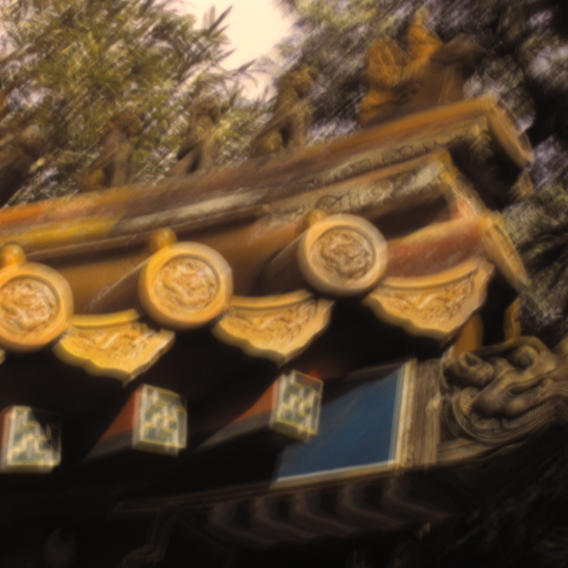 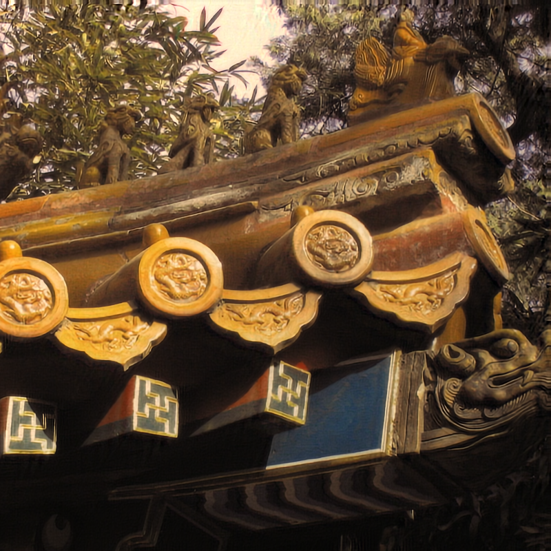

- Deblur_set2

 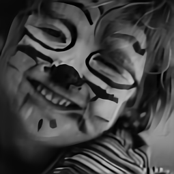

- Deblur_set3

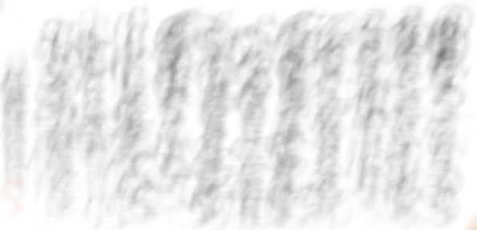 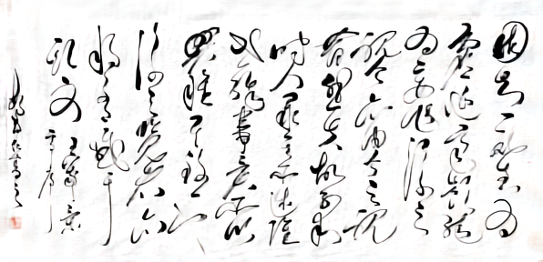

 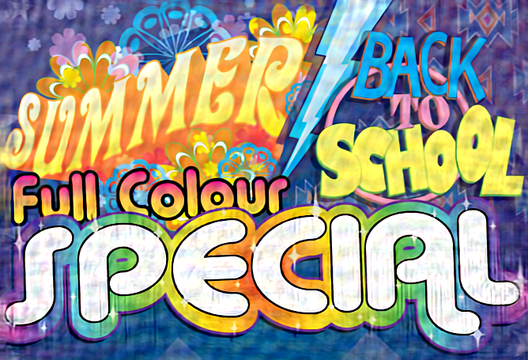

 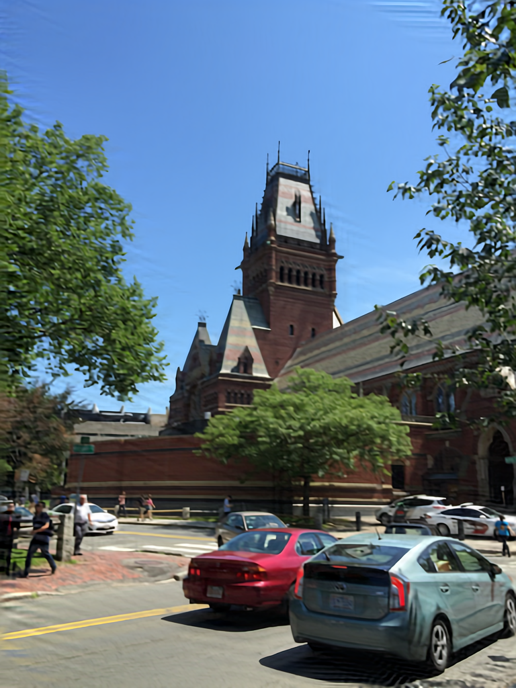


Use [Demo_deblur_real_application.m](IRCNN/Demo_deblur_real_application.m) to test IRCNN for image deblurring with estimated kernel by other blind deblurring methods.


# Single Image Super-Resolution (SISR)

The left is the low-resolution (LR) image. The right is the super-resolved image by IRCNN.

- SISR_set1, synthetic LR image

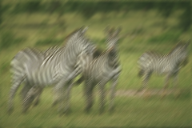 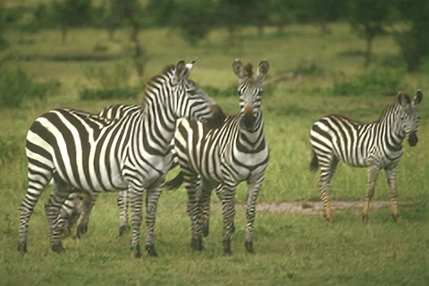

 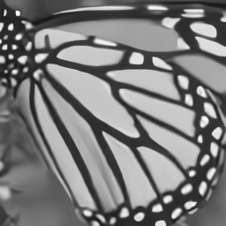

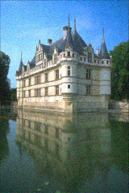 

- SISR_set2, real LR image

 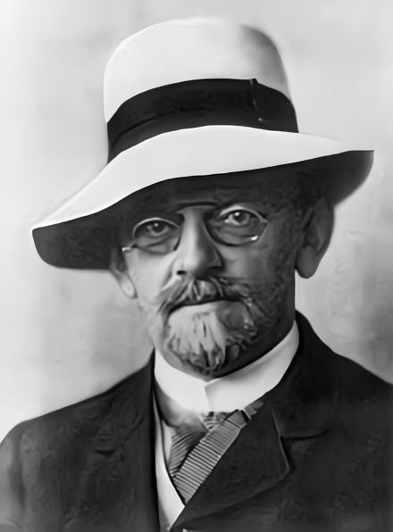

 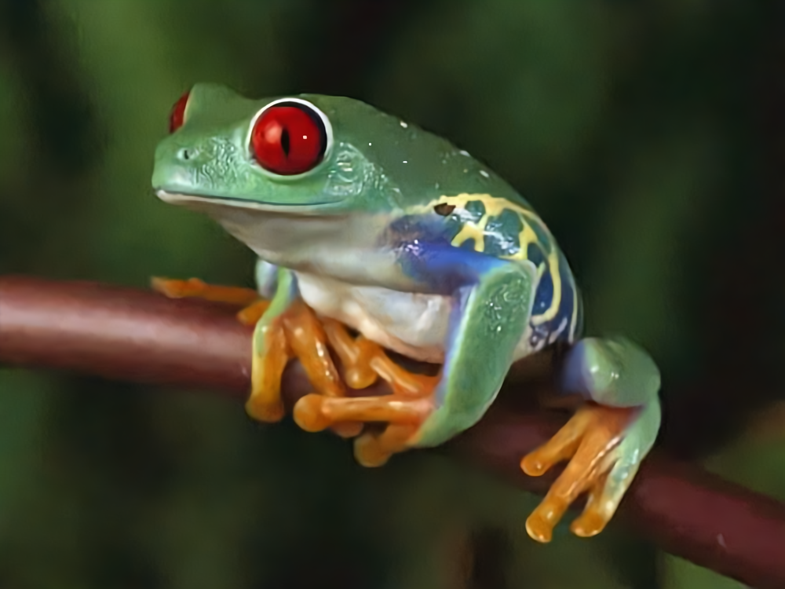

 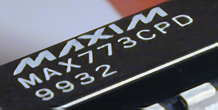

Use [Demo_SISR_direct_downsampler_real_application.m](IRCNN/Demo_SISR_direct_downsampler_real_application.m) to produce the above SISR results.


# Requirements and Dependencies
- MATLAB R2015b
- [Cuda](https://developer.nvidia.com/cuda-toolkit-archive)-8.0 & [cuDNN](https://developer.nvidia.com/cudnn) v-5.1
- [MatConvNet](http://www.vlfeat.org/matconvnet/)

# Citation

```
 @inproceedings{zhang2017learning,
   title={Learning Deep CNN Denoiser Prior for Image Restoration},
   author={Zhang, Kai and Zuo, Wangmeng and Gu, Shuhang and Zhang, Lei},
   booktitle={IEEE Conference on Computer Vision and Pattern Recognition},
   pages={3929--3938},
   year={2017},
 }
 ```
