# [Learning Deep CNN Denoiser Prior for Image Restoration](http://www4.comp.polyu.edu.hk/~cslzhang/paper/IRCNN_CVPR17.pdf)


# Abstract
Model-based optimization methods and discriminative learning methods have been the two dominant strategies for solving various inverse problems in low-level vision.
Typically, those two kinds of methods have their respective merits and drawbacks, e.g., model-based optimization methods are flexible for handling different inverse problems but are usually time-consuming with sophisticated priors for the purpose of good performance; in the meanwhile, discriminative learning methods have fast testing speed but their application range is greatly restricted by the specialized task.
Recent works have revealed that, with the aid of variable splitting techniques, denoiser prior can be plugged in as a modular part of model-based optimization methods to solve other inverse problems (e.g., deblurring). Such an integration induces considerable advantage when the denoiser is obtained via discriminative learning. However, the study of integration with fast discriminative denoiser prior is still lacking. To this end, this paper aims to train a set of fast and effective CNN (convolutional neural network) denoisers and integrate them into model-based optimization method to solve other inverse problems. Experimental results demonstrate that the learned set of denoisers can not only achieve promising Gaussian denoising results but also can be used as prior to deliver good performance for various low-level vision applications.

# Basic Idea
With the aid of variable splitting techniques, such as alternating direction method of multipliers (ADMM) method and half quadratic splitting (HQS) method, it is possible to deal
with fidelity term and regularization term of general image restoration formulation separately, and particularly, the regularization term only corresponds to a denoising subproblem. 
Consequently, this enables an integration of any discriminative denoisers into model-based optimization methods to solve various image restoration tasks, such as 
- **Image Deblurring**
- **Image Inpainting**
- **Single Image Super-Resolution** 
- **Color Image Demosaicking**


There is no additional training for these tasks.

# Half-Quadratic Splitting (HQS) Algorithm
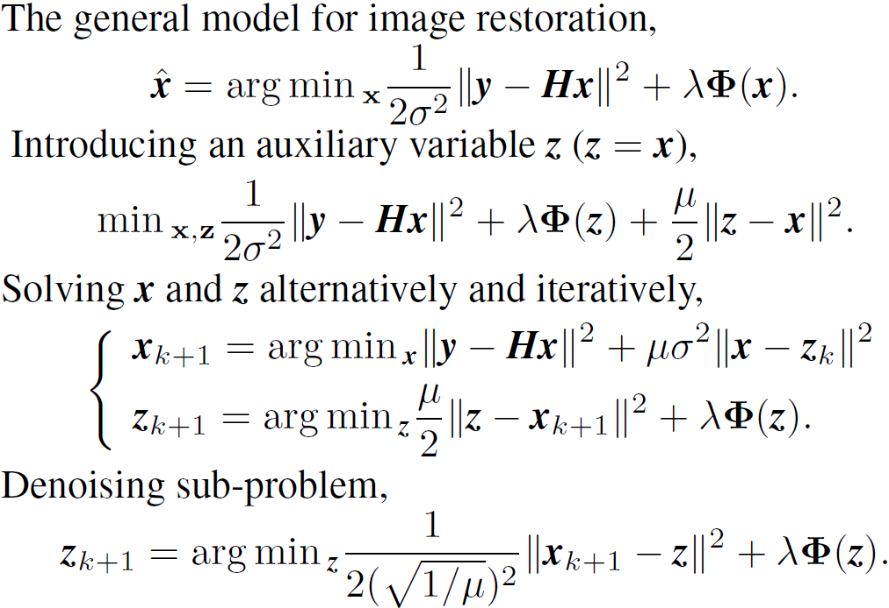


# Image Deblurring
 The left is the blurred image. The right is the deblurred image by IRCNN with estimated kernels by other blind deblurring methods.
- Deblur_set1

  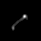

- Deblur_set2

  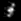

- Deblur_set3

  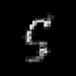

  

  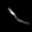


Use [Demo_deblur_real_application.m](Demo_deblur_real_application.m) to test IRCNN for image deblurring with estimated kernel by other blind deblurring methods.

# Image Inpainting

The left is the masked image. The right is the recovered image by IRCNN.

- Inpaint_set1

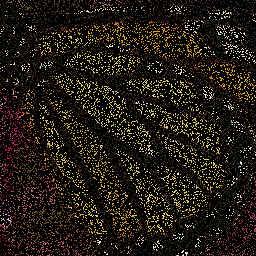 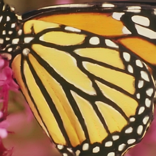

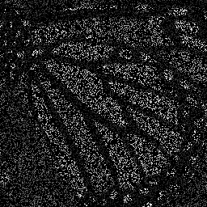 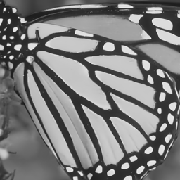

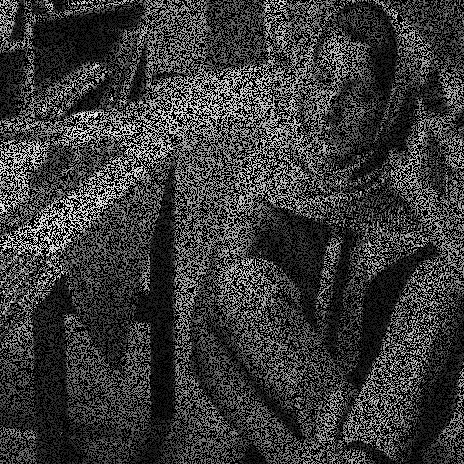 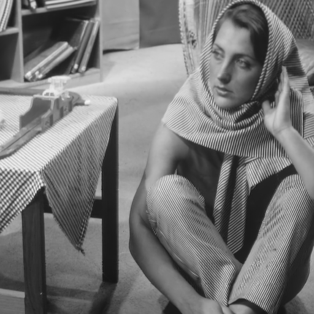

- Inpaint_set2

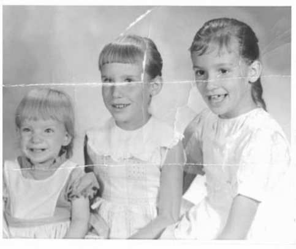  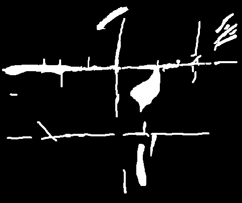

 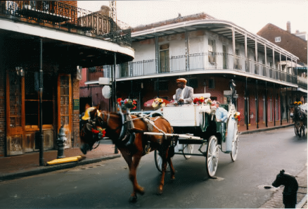 

Use [Demo_inpaint.m](./Demo_inpaint.m) and [Demo_inpaint_real_application.m](Demo_inpaint_real_application.m) to produce the above results.

# Single Image Super-Resolution (SISR)

#### IRCNN considers three degradation models for SISR.

#### 1. Bicubic degradation

```matlab
y = imresize(x, 1/sf, 'bicubic') % y: LR image; x: clean HR image; sf: scale factor
```

IRCNN for bicubic degradation has a comparable performance to VDSR and DnCNN.

Use [Demo_SISR_YCbCr.m](./Demo_SISR_YCbCr.m) and [Demo_SISR_RGB.m](./Demo_SISR_RGB.m) to produce the SISR results.

#### 2. Blurring by Gaussian kernel followed by downsampling

For scale factor 3,

```matlab
kernelsize = ceil(sigma*3)*2+1; % or 7 for sigma = 1.6
kernel     = fspecial('gaussian',kernelsize,sigma);
blur_HR    = imfilter(im,kernel,'replicate')
LR         = imresize(blur_HR, 1/scale, 'nearest');
```

For scale factors 2 and 4,

```matlab
kernelsize = ceil(sigma*3)*2+2;
kernel     = fspecial('gaussian',kernelsize,sigma);
blur_HR    = imfilter(im, kernel,'replicate');
LR         = blur_HR(scale/2:scale:end-scale/2,scale/2:scale:end-scale/2,:);
```

Use [Demo_SISR_YCbCr.m](./Demo_SISR_YCbCr.m) and [Demo_SISR_RGB.m](./Demo_SISR_RGB.m) to produce the SISR results.

#### 3. Blurring by ***arbitrary*** kernel followed by standard K-fold downsampler (matlab function '***downsample***')

```matlab
blur_HR    = imfilter(im, kernel,'replicate'); % kernel can be arbitrary, such as motion blur, Gaussian blur.
for i = 1:size(x,3)
 LR(:,:,i) = downsample(downsample(blur_HR(:,:,i),sf)',sf)';
end
```

More details on this degradation model can be found in the following paper.

[1] Chan, Stanley H., Xiran Wang, and Omar A. Elgendy. "Plug-and-Play ADMM for image restoration: Fixed-point convergence and   applications." IEEE Transactions on Computational Imaging 3.1 (2017): 84-98.


The left is the zoomed LR image (x3) with motion blur kernel, the right is the super-resolved image (x3) by IRCNN.

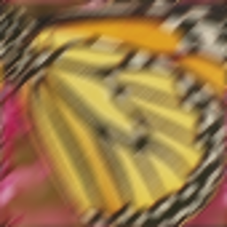 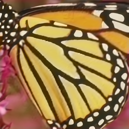

The left is the low-resolution (LR) image. The right is the super-resolved image by IRCNN.

- SISR_set1, synthetic LR image SR

 

 

- SISR_set2, real LR image SR

  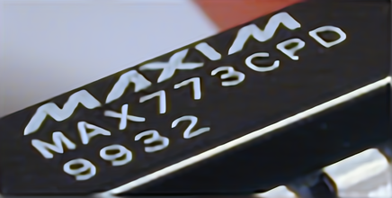

 

 

Use [Demo_SISR_direct_downsampler_real_application.m](./Demo_SISR_direct_downsampler_real_application.m) to produce the above SISR results.


# Color Image Demosaicking

The left is the mosaiced image. The right is the demosaiced image by IRCNN.

- Set18 (McMaster, IMAX)

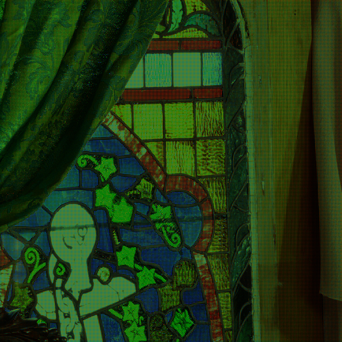 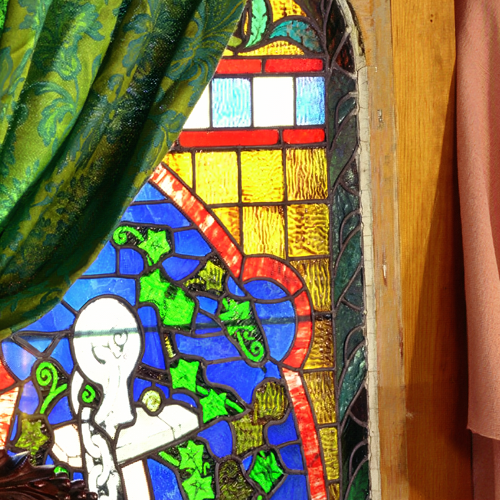

- Set24 (Kodak)

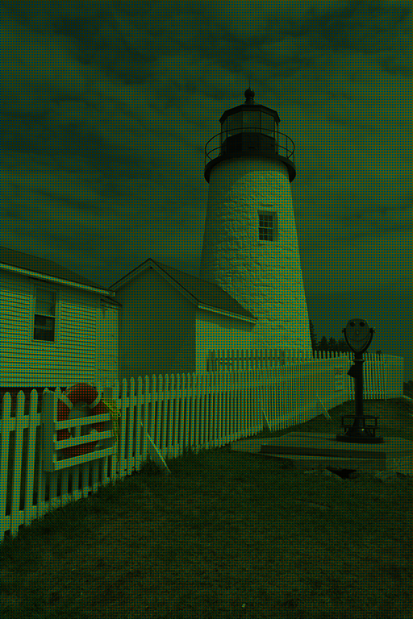 

Use [Demo_demosaiking.m](./Demo_demosaiking.m) to produce the above results.

# Requirements and Dependencies
- MATLAB R2015b
- [Cuda](https://developer.nvidia.com/cuda-toolkit-archive)-8.0 & [cuDNN](https://developer.nvidia.com/cudnn) v-5.1
- [MatConvNet](http://www.vlfeat.org/matconvnet/)

# Example: Installation of CUDNN5.1, CUDA 8.0 GA2 and Matconvnet (Windows 7 64bit) (by [kusiwu](https://github.com/kusiwu))
Download Visual studio 2015 and install it.

Download and install cuda 8.0 GA2: 
There is two installer, one is base installer and the other one is patch. You should download all of them. 
https://developer.nvidia.com/cuda-80-ga2-download-archive
First install base installer (1.3GB) and then install patch (43.1MB)
My cuda install path is: 'C:\Program Files\NVIDIA GPU Computing Toolkit\CUDA\v8.0'.
You may need to add path CUDA_PATH if the setup does not do that. (as environment variable)

Download cudnn5.1. You should register to nvidia and download cudnn 5.1.  Search in google please.
Then you should extract the zip into "C:\Program Files\NVIDIA GPU Computing Toolkit\CUDA\v8.0"
(See http://docs.nvidia.com/deeplearning/sdk/cudnn-install/index.html)
**Installations may need reboot.**

%Download matconvnet http://www.vlfeat.org/matconvnet/download/matconvnet-1.0-beta25.tar.gz
%create a directory named as "matconvnet" inside your matlab directory. 
%My matlab directory is = "D:\Program files\MATLAB\R2016b\" , yours may differ, please change yours.
%then extract matconvnet zip file and copy the file into "D:\Program files\MATLAB\R2016b\matconvnet\matconvnet-1.0-beta25"

%open matlab, all the below codes should be written into matlab command window. 
%write : in your case, the path can be different !!! Select visual studio 2015 path both C and C++ compiler.
```
mex -setup
mex -setup:'D:\Program files\MATLAB\R2016b\bin\win64\mexopts\msvc2015.xml' C

mex -setup C++
mex -setup:'D:\Program files\MATLAB\R2016b\bin\win64\mexopts\msvcpp2015.xml' C++

cd 'D:\Program files\MATLAB\R2016b\matconvnet\matconvnet-1.0-beta25'
addpath matlab

%run this
vl_compilenn('enableGpu', true, 'cudaMethod', 'nvcc', ...
               'cudaRoot', 'C:\Program Files\NVIDIA GPU Computing Toolkit\CUDA\v8.0', ...
               'enableCudnn', true, 'cudnnRoot', 'C:\Program Files\NVIDIA GPU Computing Toolkit\CUDA\v8.0') ;
```
%you will see lots of these messages and also many warnings may occur.

> %Building with 'Microsoft Visual C++ 2015 Professional'.
> %MEX completed successfully.
> %Building with 'Microsoft Visual C++ 2015 Professional (C)'.
> %MEX completed successfully.


%write this 
[`gpuDevice`](https://www.mathworks.com/help/distcomp/examples/selecting-a-gpu-device-and-examining-its-properties.html?requestedDomain=true)
and you should see something like that, but name may differ related with your graphic card.

> CUDADevice with properties:
> 
>                       Name: 'Tesla K20c'
>                      Index: 1
>          ComputeCapability: '3.0'
>             SupportsDouble: 1
>              DriverVersion: 6
>             ToolkitVersion: 5.5000
>         MaxThreadsPerBlock: 1024
>           MaxShmemPerBlock: 49152
>         MaxThreadBlockSize: [1024 1024 64]
>                MaxGridSize: [2.1475e+09 65535 65535]
>                  SIMDWidth: 32
>                TotalMemory: 5.0330e+09
>            AvailableMemory: 4.9185e+09
>        MultiprocessorCount: 13
>               ClockRateKHz: 705500
>                ComputeMode: 'Default'
>       GPUOverlapsTransfers: 1
>     KernelExecutionTimeout: 0
>           CanMapHostMemory: 1
>            DeviceSupported: 1
>             DeviceSelected: 1


%Lets test the system.
`vl_testnn`

%You will see messages like that this test may take 10 -20minute.

> Done nnbilinearsampler[dataType=single,device=cpu]/bwd_data_consistency(ih=value2,iw=value1,oh=value1,ow=value2,multiple_grids=value1) in 0.00029763 seconds
> Running nnbilinearsampler[dataType=single,device=cpu]/bwd_data_consistency(ih=value2,iw=value1,oh=value1,ow=value2,multiple_grids=value2)
> Done nnbilinearsampler[dataType=single,device=cpu]/bwd_data_consistency(ih=value2,iw=value1,oh=value1,ow=value2,multiple_grids=value2) in 0.00046763 seconds
> %At the end you should see a message like that:
> %Totals:
> %   3586 Passed, 0 Failed, 0 Incomplete.
> %   1439.9093 seconds testing time.
> 
   
## Testing IRCNN Demos
Unzip IRCNN into a folder named for example:
D:\IRCNN

The last step, open matlab command window and write these,

```
cd 'D:\IRCNN'
Demo_demosaiking.m
```


# Citation

```
 @inproceedings{zhang2017learning,
   title={Learning Deep CNN Denoiser Prior for Image Restoration},
   author={Zhang, Kai and Zuo, Wangmeng and Gu, Shuhang and Zhang, Lei},
   booktitle={IEEE Conference on Computer Vision and Pattern Recognition},
   pages={3929--3938},
   year={2017},
 }
 ```
